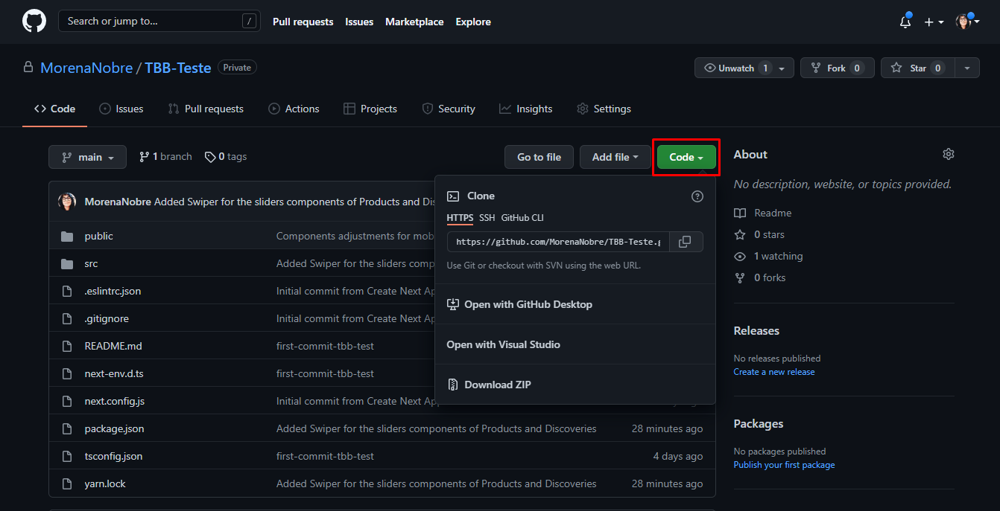

<h1 align="center">Landing Page - Intibiome (teste prático)</h1>

<blockquote align="center">“A chave para transformação é a continuidade. Continue a codar!!!”</blockquote>

 

 
 

## 🔖  Sobre
 

  

 
Esse é um teste prático realizado para um processo seletivo. O objetivo do projeto foi desenvolver uma Landing page responsiva, contendo Header, Menu, Banners, Main, Carousel e Footer.
 
 

## 🚀 Tecnologias utilizadas
O projeto foi desenvolvido utilizando as seguintes tecnologias

- ReactJS
- Typescript
- Chakra UI
- Swiper
- Sass
- NextJS

## 🗂 Como clonar a aplicação
 

  

 

Para clonar o repositório, clique no botão "Code" e irá aparecer um menu. Copie a URL que aparece logo abaixo do botão.
 
No seu terminal, navegue até a sua pasta de preferência e rode o comando git clone {URL_DO_REPOSITORIO}, isso irá baixar todos os arquivos para a sua máquina. Lembre-se que você precisa do Git instalado em sua máquina, caso ainda não tenha: <a align="center" href="https://git-scm.com/">Site Git</a>
 
Com seu repositório baixado na sua máquina, execute o comando `yarn` na pasta do projeto clonado para instalar todas as dependências.
 
E para rodar o projeto execute o comendo `yarn dev`, o projeto irá rodar no localhost:3000.

 
 

 
 

<h3 align="center">
    
</h3>

